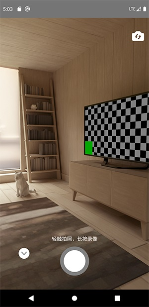

# React Native Camera View

#### Simple controls for react-native-camera



## Dependent

+ react-native-camera
+ react-native-circular-progress
+ react-native-fs
+ react-native-svg
+ react-native-video
+ react-navigation (router framework, optional)

## Usage
example with react-navigation 5.x
```jsx
import 'react-native-gesture-handler';
import * as React from 'react';
import {Button, View, Image} from "react-native";
import {NavigationContainer} from '@react-navigation/native';
import {createStackNavigator} from '@react-navigation/stack';
import Video from "react-native-video";

import RNCameraView from "react-native-camera-view";

const Stack = createStackNavigator();

function Media({navigation, route}) {
    const [source, setSource] = React.useState(null);

    React.useEffect(() => {
        if (route.params && route.params.source) {
            setSource(route.params.source);
            console.log(route.params.source)
        }
    }, [route.params]);

    return (
        <View>
            <Button title={"Shot"} onPress={() => {
                navigation.push('Camera');
            }}/>
            {
                source && source.type === "image" ? <Image source={source} style={{width: 200, height: 200}}/> : null
            }
            {
                source && source.type === "video" ?
                    <Video source={source} style={{width: 200, height: 200}} controls/> : null
            }
        </View>
    );
}

function Camera({navigation}) {
    return (
        <RNCameraView
            onBack={(source) => {
                if (source) {
                    navigation.navigate("Media", {
                        source: {...source}
                    });
                } else {
                    navigation.goBack();
                }
            }}
        />
    );
}

function Home() {
    return (
        <Stack.Navigator>
            <Stack.Screen name="Media" component={Media}/>
            <Stack.Screen
                options={
                    {
                        headerShown: false
                    }
                }
                name="Camera" component={Camera}
            />
        </Stack.Navigator>
    );
}


export default function App() {
    return (
        <NavigationContainer>
            <Home/>
        </NavigationContainer>
    );
}
```

## Props

#### videoQuality
  
This option specifies the quality of the video to be taken, default 480p.
```jsx
import {VideoQuality} from "react-native-camera-view";

// VideoQuality["480p"]
// VideoQuality["1080p"]
// ...
```

<br>

#### videoDuration
default 10000 (10s);


<br>


#### videoBitrate

 (int greater than 0) This option specifies a desired video bitrate. For example, 5 * 1000 * 1000 would be 5Mbps.
 default use medium bitrate for 480p.
```jsx

/**
use high video bitrate
*/

import {HighBitrate} from "react-native-camera-view";

const videoWidth = 1920;
const videoHeight = 1080;

// easy way to calculate video bitrate
const videoBitrate = HighBitrate(videoWidth, videoHeight);
```

#### videoProps 
component properties object for `react-native-video`.

<br>
 
#### imageProps
component properties object for `Image`.
 
<br>
 
#### recordOptions
supported options for recording.

<br>

#### maxImageWidth
default 1920, set 0 / null / undefined is not be effected.
 
<br>
 
#### imageQuality
(float between 0 to 1.0), default 1.0
 
<br>

#### takePictureOptions
supported options for taking picture.

<br>

#### cameraProps
component properties object for `react-native-camera`.

<br> 
 
#### onBack
function to be called when confirm or cancel capturing.
```jsx
import RNCameraView from "react-native-camera-view";

export default ()=>
{
    return (
        <RNCameraView 
            onBack={(result)=>{
                if(result){
                    const {uri,type} = result;
                    if(video === "video") {
                        // video
                    }
                    else {
                        // image
                    }
                }
                else {
                    // cancel
                }   
            }}
        />
    );
}
```

<br>

#### disableRecording
default false

<br>

#### disableTakingPicture
default false